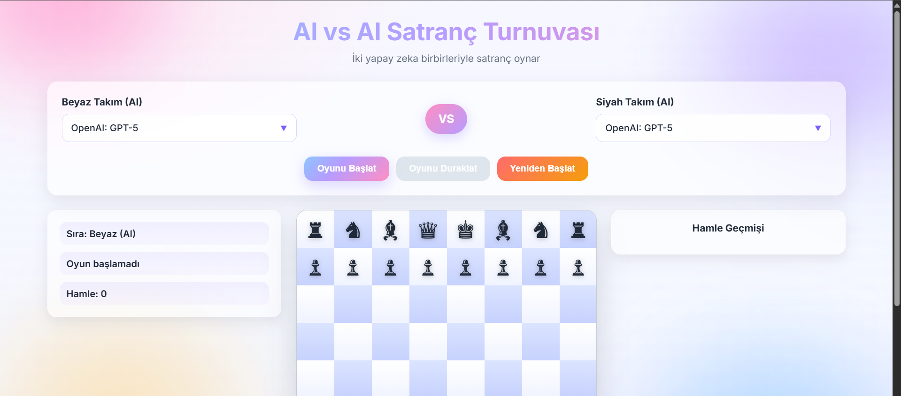

## AI vs AI Satranç Turnuvası

Tarayıcı üzerinde çalışan, iki yapay zekanın birbiriyle satranç oynadığı etkileşimli bir uygulama. Modeller OpenRouter üzerinden seçilir, hamleler arayüzde canlı güncellenir ve hamle geçmişi tutulur.

### Canlı Örnek/Kaynak
- Kaynak kod: [perfectusmim1/AI-Chess](https://github.com/perfectusmim1/AI-Chess)

### Özellikler
- OpenRouter üzerinden model listesi çekme ve filtreleme
- Beyaz ve siyah için ayrı model seçimi (searchable dropdown)
- AI vs AI otomatik oynatma, duraklatma ve yeniden başlatma
- Hamle geçmişi ve son hamle vurgulama
- Şah, rok, en passant ve terfi gibi kuralların kontrolü

### Hızlı Başlangıç (Lokal)
1. Depoyu klonlayın veya indirin.
2. `index.html` dosyasını bir tarayıcıda açın (güvenilir bir sunucudan açmak için basit bir live server da kullanabilirsiniz).
3. OpenRouter API anahtarınızı girin ve “Modelleri Yükle” butonuna tıklayın.
4. Beyaz ve siyah takımlar için modelleri seçin.
5. “Oyunu Başlat” ile AI’ların oynamasını izleyin.

### Kullanım Akışı
1. API anahtarını girip “Modelleri Yükle” deyin.
2. Açılan arama kutularından uygun modelleri seçin.
3. “Oyunu Başlat” ile oyun başlar; “Oyunu Duraklat” ve “Yeniden Başlat” butonlarıyla kontrol edebilirsiniz.
4. Sağdaki “Hamle Geçmişi” alanından ilerlemeyi takip edin.

### Notlar
- API anahtarı yerel tarayıcı `localStorage` içinde base64 olarak saklanır; sayfa yenilendiğinde modelleri tekrar yükleyebilirsiniz.
- OpenRouter hataları (401/402/429/5xx) arayüzde ve konsolda bildirilir.

### Proje Yapısı
- `index.html`: Uygulama iskeleti ve script bağları
- `style.css`: Arayüz ve görsel tema
- `chess-logic.js`: Oyun kuralları ve hamle validasyonları
- `ai-integration.js`: OpenRouter model listesi ve hamle üretimi entegrasyonu
- `main.js`: UI mantığı, olay bağları, oyun akışı

### Gereksinimler
- Modern bir tarayıcı (Chrome, Edge, Firefox, Safari)
- OpenRouter API anahtarı (ücretlendirme/limitler OpenRouter tarafından yönetilir)

